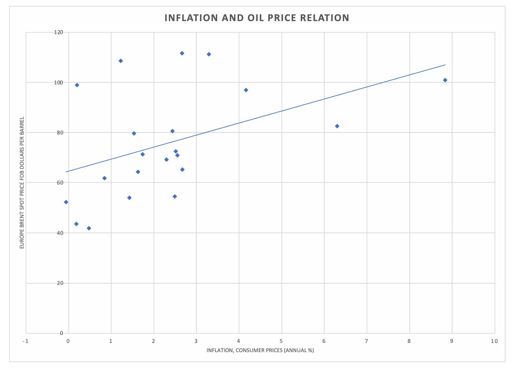
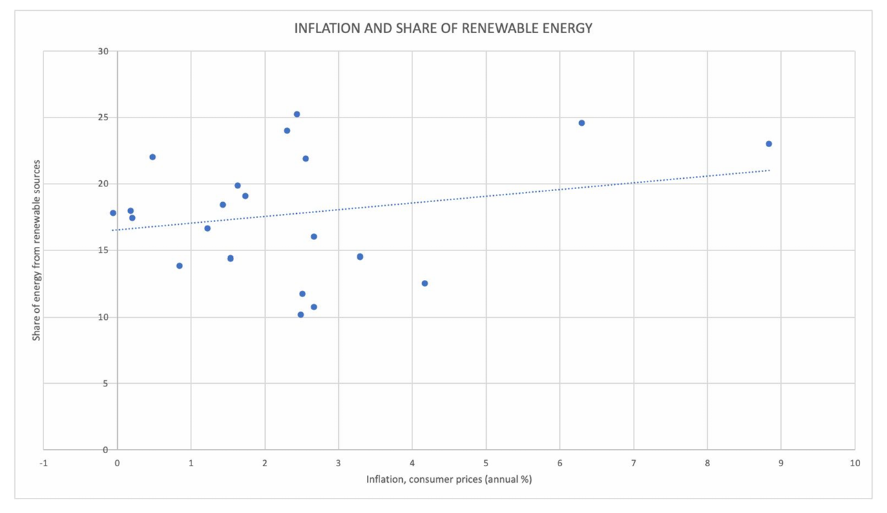
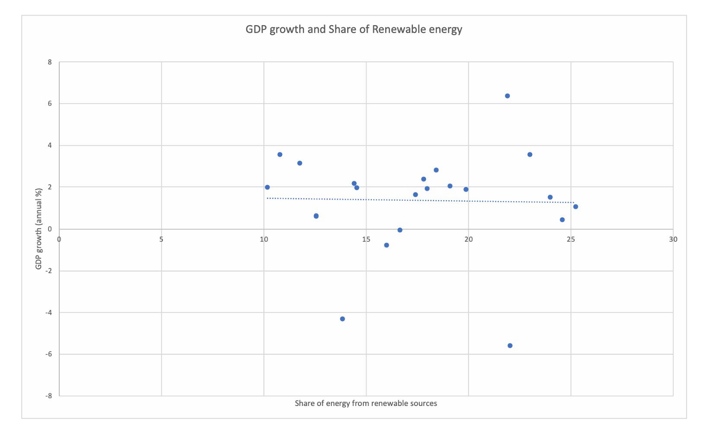

## Research Project

### Analysing How the Transition to Renewable Energy Affects Inflation, Growth, and Macroeconomic Stability

This project examines the relationship between the transition to renewable energy and macroeconomic stability in the European Union. The study focuses on how renewable energy share, oil prices, GDP growth, and exchange rates are associated with inflation dynamics.

The analysis uses annual macroeconomic data and an **Autoregressive Distributed Lag (ARDL)** model to investigate both short-run and long-run relationships between the variables.

---

## Research Question

**Do renewable energy transitions enhance macroeconomic stability in the European Union by affecting the inflation and economic growth processes?**

---

## Objective

The main objective of this study is to investigate the effect of the transition to renewable energy sources on:

* Inflation
* Economic growth
* Macroeconomic stability

The study also examines the role of oil prices, GDP growth, exchange rates, and inflation persistence in explaining inflation dynamics.

---

## Variables

| Variable               | Role                 |
| ---------------------- | -------------------- |
| Inflation              | Dependent Variable   |
| Renewable Energy Share | Independent Variable |
| Oil Price              | Independent Variable |
| GDP Growth             | Independent Variable |
| Exchange Rate          | Independent Variable |

The data used in the study are annual secondary data sourced from the **European Central Bank (ECB), World Bank, and Eurostat**.

---

## Methodology

The study follows a time-series econometric approach.

### 1. Descriptive Analysis

Descriptive statistics are used to understand the distribution, central tendency, and variability of the variables.

### 2. Correlation Analysis

Scatter plots and correlation coefficients are used to examine relationships between:

* Inflation and oil prices
* Inflation and renewable energy share
* GDP growth and renewable energy share

### 3. ARDL Model

An **Autoregressive Distributed Lag (ARDL)** model is used to capture both short-run dynamics and long-run relationships.

The model includes:

* Lagged inflation
* Oil prices
* GDP growth
* Renewable energy share
* Exchange rate

The selected specification is:

**ARDL(1; Oil=1, GDP=1, Renewable Energy=0, Exchange Rate=0)**

The model is appropriate for the study because the variables contain a mixture of I(0) and I(1) variables, with no evidence of I(2).

### 4. Bounds Test

The ARDL bounds test is used to examine whether a long-run relationship exists between the variables.

### 5. Forecasting

Inflation forecasts are generated using:

* ARDL
* ARIMAX

The forecasts cover the period **2026–2030**.

---

## Key Findings

### Short-Run Results

The analysis indicates that inflation has significant persistence, with lagged inflation positively affecting current inflation.

Oil prices also have a significant short-run relationship with inflation. The current oil price effect is positive, while the lagged oil price effect is negative, indicating an adjustment following the initial energy-price shock.

Lagged GDP growth is also positively associated with inflation.

Renewable energy share and exchange rate do not show statistically significant short-run effects in the reported model.

---

## Long-Run Results

The ARDL bounds test indicates the presence of a long-run relationship between the variables.

The reported long-run results show:

* GDP growth has a positive and economically significant relationship with inflation.
* Oil prices have a positive but relatively weak long-run effect.
* Renewable energy share has a positive but statistically insignificant coefficient.

The error correction term is **-0.0939**, indicating that approximately **9.4% of the deviation from the long-run equilibrium is adjusted each year**.

---

## Forecasting Results

The ARDL model forecasts inflation to increase from approximately **2.95% in 2026 to 3.83% in 2030**.

The ARIMAX model forecasts inflation from approximately **4.40% to 4.93% by 2030**.

The two models provide different forecast paths because they capture dynamic and external factors differently.

---

## Visualisations

The repository contains the main graphs from the research analysis.

### Inflation vs Oil Price



### Inflation vs Renewable Energy Share



### GDP Growth vs Renewable Energy Share



### ARIMAX Inflation Forecast


### ARDL vs ARIMAX Forecast


---

## Repository Structure

```text
Energy-Transitions-Macroeconomic-Stability/
│
├── README.md
│
├── data/
│   └── MACRO_DATA_2005-25.xlsx
│
├── code/
│   └── ARDL_Analysis.py
│
├── graphs/
│   ├── 01_inflation_vs_oil_price.png
│   ├── 02_inflation_vs_renewable_energy.png
│   ├── 03_gdp_growth_vs_renewable_energy.png
│   ├── 04_arimax_inflation_forecast_2026_2030.png
│   ├── 05_ardl_vs_arimax_forecast.png
│   └── README.md
│
└── report/
    └── Adv Macroeconomics II.pdf
```

---

## Tools and Technologies

* **Python**
* **Pandas**
* **NumPy**
* **Matplotlib**
* **Statsmodels**
* **ARDL / Time-Series Econometrics**
* **Excel**
* **GitHub**

---

## Data Sources

The research paper identifies the following sources for the macroeconomic data:

* European Central Bank (ECB)
* World Bank
* Eurostat

The dataset included in this repository contains the data used for the empirical analysis.

---

## Project Outcomes

This project demonstrates the application of time-series econometrics to study the relationship between energy transition and macroeconomic variables.

The analysis combines:

**Energy Transition → Oil Prices → Inflation → Economic Growth → Macroeconomic Stability**

The project also demonstrates the use of ARDL and forecasting techniques to distinguish between short-run dynamics and long-run relationships.

---


This repository contains the data, Python code, visualisations, and research material associated with the academic project. The findings and interpretations presented are based on the dataset and methodology used in the study.
